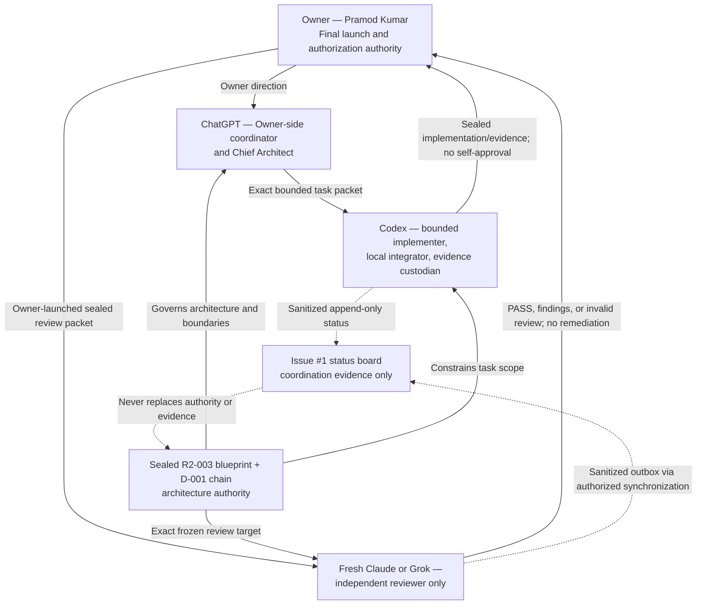
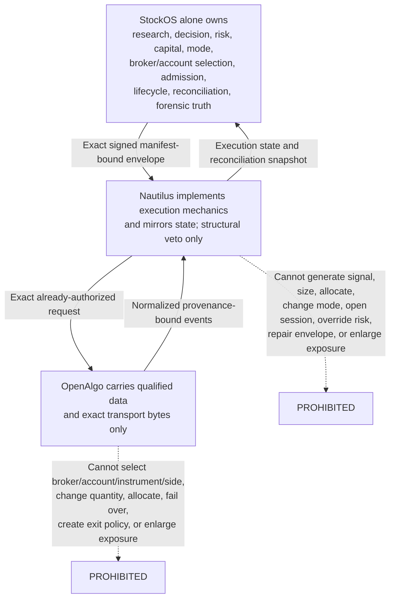
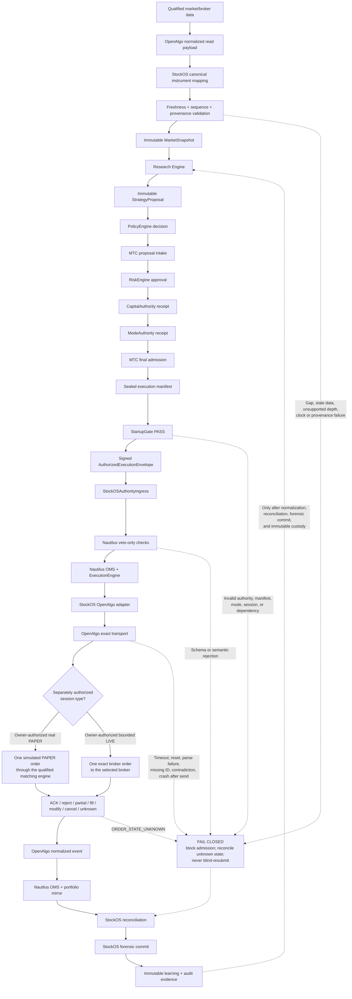
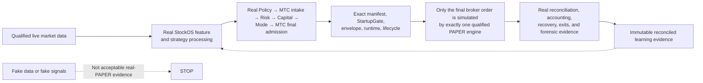
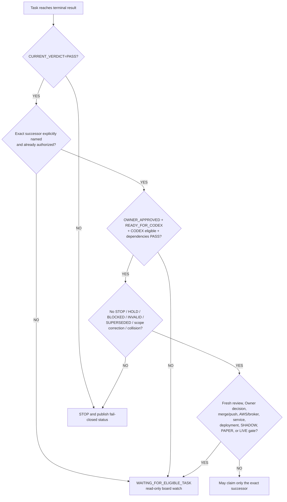
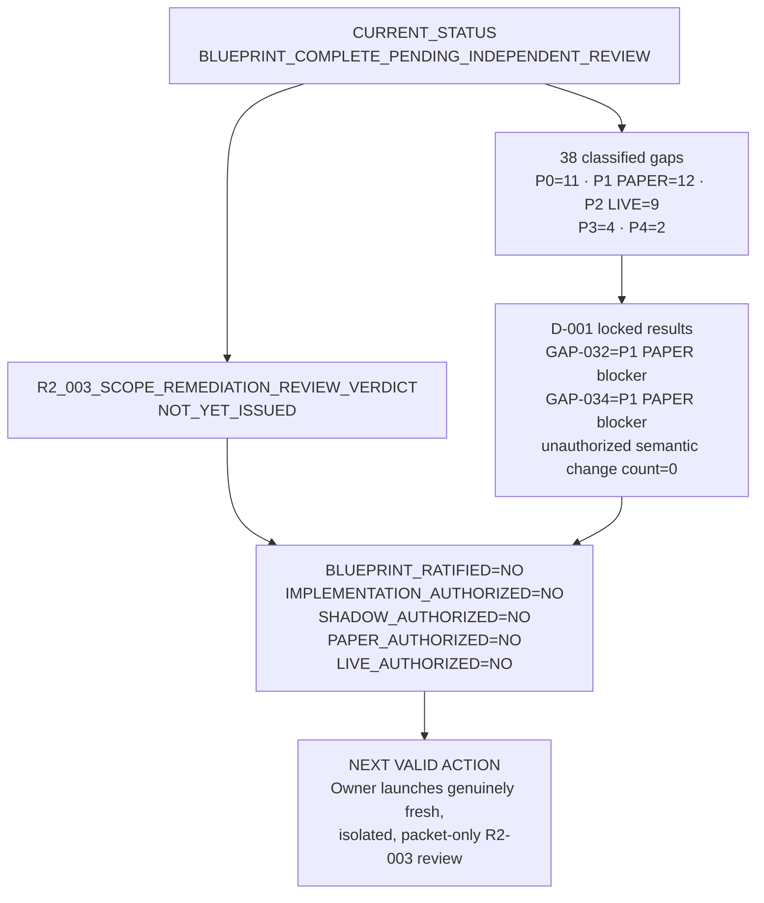

# StockOS R2-003 Visual Blueprint

DOCUMENT_CLASS=NON_NORMATIVE_MERMAID_VISUAL_NAVIGATION
AUTHORITATIVE_BLUEPRINT=STOCKOS_THREE_LAYER_FINAL_BLUEPRINT_R2_003.md
AUTHORITATIVE_BLUEPRINT_SHA256=e407d7a5a3753b1455372635cfd982efbd5a590f7c868a1e961daafb38431376
AUTHORITATIVE_BLUEPRINT_SIZE=39665
CORRECTION_SCOPE=D-001_AND_PERMITTED_PACKAGE_PROVENANCE_ONLY
DO_NOT_USE_AS_REPLACEMENT_BLUEPRINT=YES

BLUEPRINT_RATIFIED=NO
IMPLEMENTATION_AUTHORIZED=NO
SHADOW_AUTHORIZED=NO
PAPER_AUTHORIZED=NO
LIVE_AUTHORIZED=NO

This visual is a non-normative navigation aid derived only from the exact
sealed R2-003 blueprint and its D-001 scope-correction chain. It adds no
architecture, requirement, readiness claim, or authorization. If any diagram
or explanation conflicts with the exact blueprint, the exact blueprint wins.

- [Exact authoritative blueprint](https://github.com/mvmjandaha-art/stockos-agent-status/blob/main/blueprints/r2-003/STOCKOS_THREE_LAYER_FINAL_BLUEPRINT_R2_003.md)
- [D-001 scope-correction ledger](https://github.com/mvmjandaha-art/stockos-agent-status/blob/main/blueprints/r2-003/STOCKOS_THREE_LAYER_R2_D001_SCOPE_CORRECTION_LEDGER.md)
- [Detailed navigation and gap register](https://github.com/mvmjandaha-art/stockos-agent-status/blob/main/blueprints/r2-003/START_HERE_STOCKOS_R2_003.md)

## 1. Owner, Architect, and Agent Authority



Authority rules:

- Owner authorization is required for fresh review launch, blueprint
  ratification, implementation, SHADOW, PAPER, and LIVE.
- ChatGPT coordinates architecture on the Owner side but does not replace the
  Owner's final authority.
- Codex must not approve or independently review its own implementation.
- A fresh Claude/Grok reviewer must not implement, edit, remediate, commit,
  merge, push, deploy, or operate during review.
- Board comments coordinate work; they do not replace the blueprint, exact
  task packet, candidate identity, sealed evidence, or Owner decision.

Source: blueprint §§32, 35, and 36.

## 2. Exact Three-Layer Architecture

```mermaid
flowchart LR
    MD["Selected qualified broker<br/>read API / stream"]
    BR["Selected broker"]

    subgraph L3["Layer 3 — OpenAlgo connectivity"]
        OAData["Qualified market-data REST/WS<br/>normalized broker payload"]
        OAMap["Broker capability +<br/>canonical symbol mapping"]
        OATransport["Exact place / modify / cancel transport<br/>exact request and response byte custody"]
        OAEvents["Normalized broker events"]
    end

    subgraph L1["Layer 1 — StockOS authority"]
        Ingress["Market-data ingress<br/>freshness + sequence + provenance"]
        Snapshot["Immutable MarketSnapshot"]
        Research["Research + immutable<br/>strategy artifacts"]
        Policy["PolicyEngine"]
        MTC1["MTC proposal intake"]
        Risk["RiskDecision"]
        Capital["CapitalDecision"]
        Mode["ModeAuthority"]
        MTC2["MTC final admission"]
        Manifest["Sealed execution manifest<br/>+ StartupGate"]
        Envelope["AuthorizedExecutionEnvelope"]
        Reconcile["StockOS reconciliation"]
        Forensic["StockOS forensic ledger"]
        Learning["Immutable StockOS<br/>learning evidence"]
    end

    subgraph L2["Layer 2 — Nautilus execution implementation"]
        NIngress["StockOSAuthorityIngress<br/>exact envelope verification"]
        Veto["Veto-only structural checks"]
        OMS["Nautilus OMS + order state"]
        Exec["Nautilus ExecutionEngine"]
        Mirror["Portfolio state mirror"]
    end

    MD --> OAData --> Ingress --> Snapshot --> Research --> Policy
    Policy --> MTC1 --> Risk --> Capital --> Mode --> MTC2 --> Manifest --> Envelope
    Envelope --> NIngress --> Veto --> OMS --> Exec --> OAMap --> OATransport --> BR
    BR --> OAEvents --> OMS
    OMS --> Mirror --> Reconcile --> Forensic --> Learning
    Learning -.->|"Reconciled and immutable evidence only"| Research
```



### Authority boundaries



The three systems are separate processes with strict versioned contracts and
one active writer per authority state.

Source: blueprint §§1, 6, and 8–21.

## 3. Complete Market-to-Decision-to-Risk-to-Execution Flow



There must be no shorter proposal-to-order path. One valid envelope maps to
one exact order. Neither Nautilus nor OpenAlgo may change approved quantity.
Unknown write state blocks conflicting orders and requires reconciliation.

Source: blueprint §§12–21.

## 4. Real PAPER Definition and Learning Loop



Initial transition locked by the blueprint:

```text
MARKET_DATA=OPENALGO_OR_CURRENT_QUALIFIED_LIVE_FEED
DECISION_ENGINE=STOCKOS
RISK_AND_CAPITAL=STOCKOS
PAPER_EXECUTION=EXISTING_STOCKOS_PAPERBROKER
NAUTILUS_SIMULATION=OBSERVER_ONLY
OPENALGO_ORDER_ENDPOINTS=PHYSICALLY_BLOCKED
ONE_SESSION_ONE_MATCHING_ENGINE=YES
```

Nautilus simulation becomes the StockOS PAPER execution implementation only
after measured equivalence and explicit cutover for an exact session type.

Source: blueprint §§8, 14, and 22.

## 5. Blueprint-to-SHADOW-to-PAPER-to-LIVE Gated Path

```mermaid
flowchart LR
    P0["R2-003 handoff verification"]
    P1["Fresh independent<br/>blueprint review"]
    P2["Owner / Architect<br/>ratification decision"]
    P3["Exact Owner-authorized<br/>bounded implementation packages"]
    P4["Focused + adversarial +<br/>full/integration tests"]
    P5["Fresh independent<br/>implementation reviews"]
    P6["Integration + packaging +<br/>operational qualification"]
    P7["Owner-authorized SHADOW<br/>live read-only data; writes blocked"]
    P8["Fresh real-PAPER<br/>readiness review"]
    P9["Owner-authorized real PAPER"]
    P10["Bounded live-data PAPER<br/>observation + evidence"]
    P11["Fresh PAPER evidence review<br/>+ LIVE-readiness assessment"]
    P12["Owner-only bounded<br/>LIVE authorization"]
    P13["Controlled LIVE rollout"]
    P14["Rollback + reconciliation +<br/>audit + post-launch governance"]

    P0 -->|"PASS only"| P1
    P1 -->|"Valid fresh PASS only"| P2
    P2 -->|"Explicit ratification + separate task"| P3
    P3 --> P4 --> P5 --> P6
    P6 -->|"Explicit Owner SHADOW authorization"| P7
    P7 --> P8
    P8 -->|"Readiness PASS + Owner authorization"| P9
    P9 --> P10 --> P11
    P11 -->|"All applicable blockers closed<br/>+ explicit Owner LIVE authorization"| P12
    P12 --> P13 --> P14
```



Every gate stops on identity drift, missing evidence, open required blockers,
unknown critical state, invalid reviewer custody, scope ambiguity, or absent
Owner authority. A documentation PASS never authorizes implementation or an
operational phase.

The blueprint's nine-stage migration path remains:

```mermaid
flowchart LR
    M0["CURRENT_STOCKOS"]
    M1["OPENALGO_READ_ONLY"]
    M2["OPENALGO_SHADOW"]
    M3["STOCKOS_PAPER_WITH_OPENALGO_DATA"]
    M4["NAUTILUS_OBSERVER"]
    M5["NAUTILUS_PAPER_EQUIVALENCE"]
    M6["NAUTILUS_RUNTIME_CUTOVER"]
    M7["BOUNDED_LIVE"]
    M8["NATIVE_HOT_PATH_ADAPTERS_IF_JUSTIFIED"]
    M0 --> M1 --> M2 --> M3 --> M4 --> M5 --> M6 --> M7 --> M8
```



Source: blueprint §§27–36.

## 6. Codex and Independent Reviewer Separation

```mermaid
sequenceDiagram
    participant Owner as Owner / Architect
    participant Codex as Codex implementer
    participant Evidence as Sealed candidate + evidence
    participant Reviewer as Fresh Claude or Grok

    Owner->>Codex: Exact authorized task, base, paths, criteria
    Codex->>Codex: Implement only bounded scope
    Codex->>Evidence: Seal candidate identity, tests, completion artifact
    Codex-->>Owner: Stop at independent-review gate
    Owner->>Reviewer: Launch fresh exact read-only review packet
    Reviewer->>Evidence: Verify frozen identity and evidence
    alt PASS
        Reviewer-->>Owner: Sealed PASS; no remediation
    else bounded findings
        Reviewer-->>Owner: Exact findings; no remediation
        Owner-->>Codex: New task only if OWNER_APPROVED and READY_FOR_CODEX
    else invalid or blocked
        Reviewer-->>Owner: Preserve candidate and BLOCK
    end
```

Source: blueprint §32 and the D-001 ledger's locked model-role boundary.

## 7. Automatic Continuation Boundary



A PASS can activate only its explicit successor. A failure can activate only
an already pre-approved bounded remediation task. Codex never invents
continuation authority.

## 8. Current Readiness and Authorization State



```text
PRODUCTION_READY=NO
PROGRAM_STATUS=DOCUMENTATION_AND_ARCHITECTURE_REMEDIATION_ONLY
NEXT_IMPLEMENTATION_PATH=NONE_UNTIL_FRESH_REVIEW_AND_SEPARATE_OWNER_DECISION
```

A valid fresh review PASS can only make R2-003 eligible for a separate Owner
ratification decision. It authorizes no implementation, dependency use,
service, AWS, broker, SHADOW, PAPER, LIVE, merge, push, or deployment action.

Source: blueprint §§33–36 and D-001 correction-ledger Locked substantive
results.
